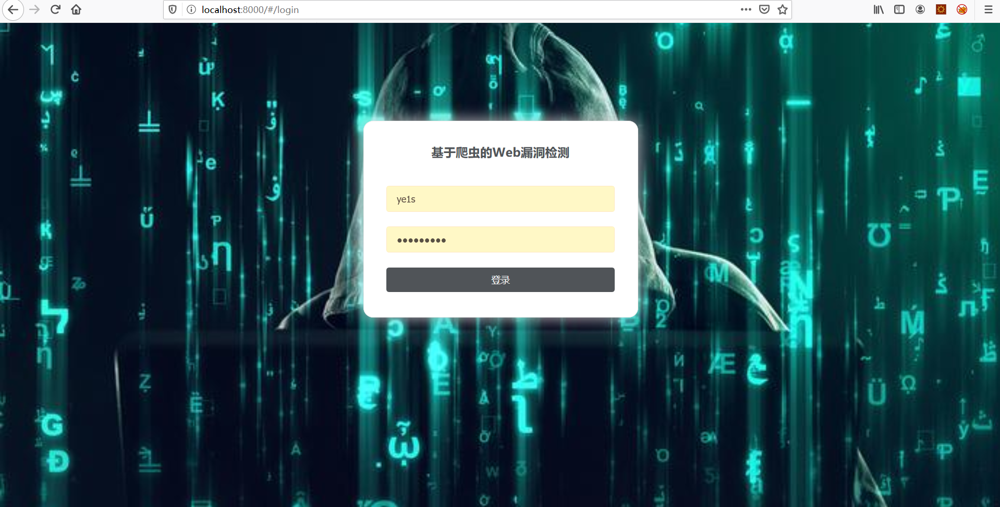
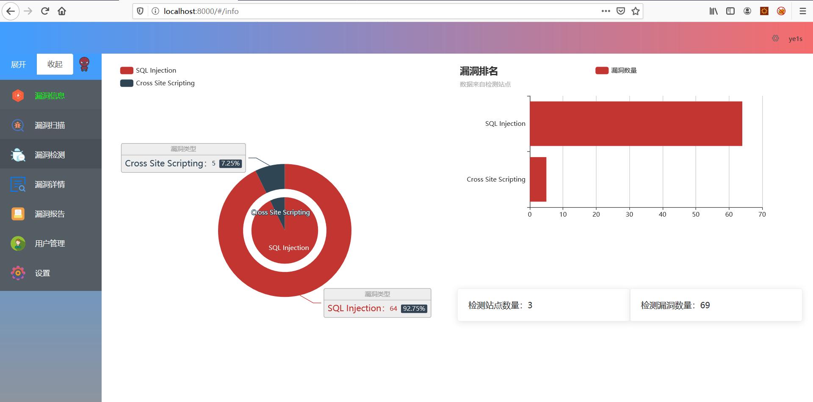
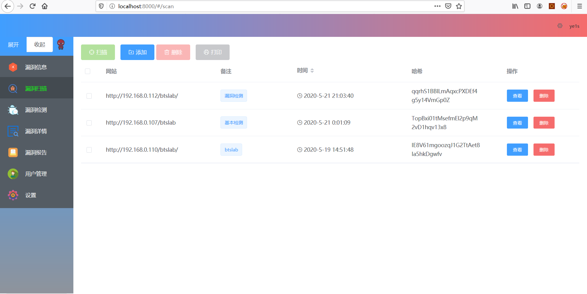
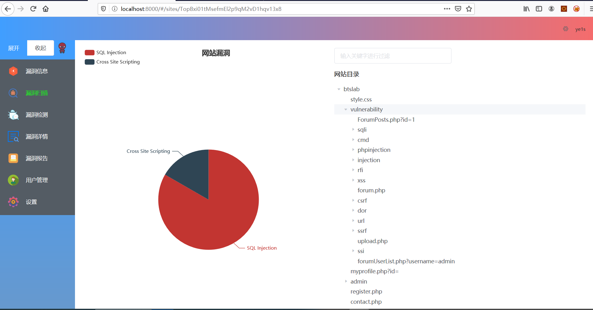
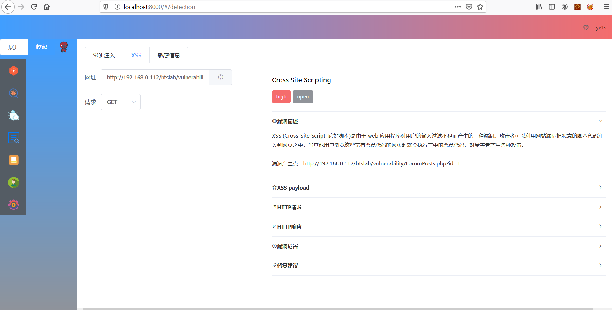
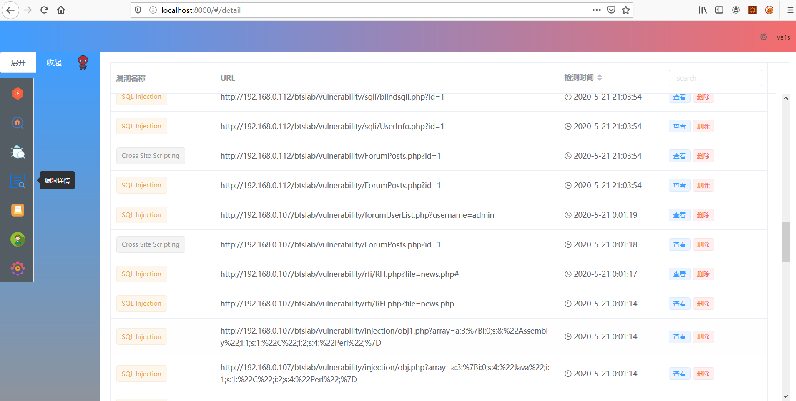

# CrawlerVuln
基于动态爬虫的Web漏洞检测。先使用Node.js puppteer的动态爬虫技术去爬取网站的链接，再对链接进行XSS和SQL注入的检测，最后Web端展示漏洞详情。写的相对比较简单，抛转引玉。

# 0x1安装环境  
本系统是前后端分离的站点。前端使用的是Vue.js,后端使用的是Node.js,数据库使用的是Mongodb。node.js和vue.js的环境要先安装后，在看以下的步骤。
# 0x1.1安装mongodb 
安装好mongodb
# 0x1.2CrawlerVulnServer

修改CrawlerVulnServer项目下的db/dbconn.js 连接mongodb数据库的地址，如果安装在本地，可以不用修改
```
var url="mongodb://localhost:27017/web"
```

找到db/dbuser.js将最下面的两个注释去掉，添加一个用户后，在重新注释掉
```
//let test={username:'test',password:'test'}
//addUser(test);
```

安装CrawlerVulnServer的依赖包。
建议使用cnpm进行安装比较快。 
用npm安装cnpm
```
npm install -g cnpm --registry=https://registry.npm.taobao.org
```

在CrawlerVulnServer项目中打开命令行界面，输入如下
```
cnpm install
```
依赖包安装好后，运行该项目
```
node index.js
```

# 0x1.3CrawlerVulnClient
找到 src/http.js，修改为CrawlerVulnServer的运行地址，如相同则不用。
```
const http=axios.create({
  baseURL:'http://localhost:3000'

})
```
安装依赖
```
cnpm install
```
运行项目
```
npm run dev
```
 

# 0x2爬虫部分
网络爬虫使用的是Node.js Puppeteer，Puppeteer 提供高级API，通过DevTools Protocol 来控制Chrome Headless。
对于爬虫部分主要在如下文章介绍爬虫的基础上，小小修改。
/)

# 0x3漏洞检索
只写了报错型SQL注入、反射型XSS、敏感文件的检测。

# 0x4Web界面
Web界面使用的是Element UI ，比较美观。







